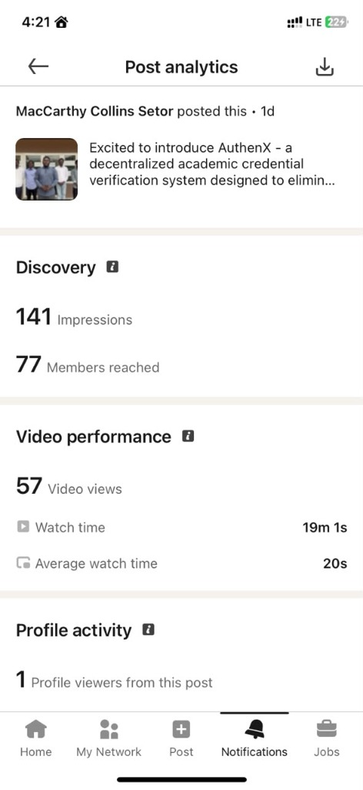
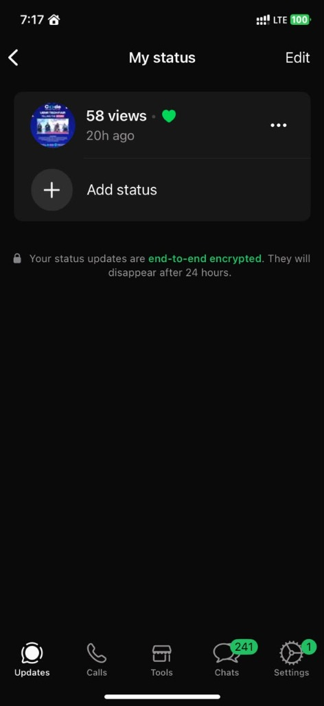
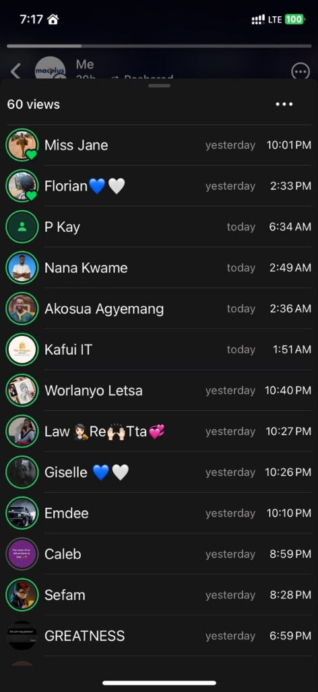

# Elevator Pitch Media Engagement Report

**Project Title:** AuthenX — Decentralized Academic Credential Verification System  
**Group Number:** Group 12  
**Institution:** University of Energy and Natural Resources (UENR)  
**Department:** Department of Information Decision Sciences (IDS)  
**Submission Date:** June 27, 2026  

---

## 1. Project Overview & Team Details
AuthenX is a hybrid Web2/Web3 platform designed to eliminate academic certificate fraud and administrative overhead. By utilizing Solidity smart contracts on the Celo Sepolia Testnet and decentralized storage via IPFS (Pinata), AuthenX brings academic credential verification times down to just 2.2 seconds. 

To raise awareness and receive early feedback, the team shared an elevator pitch video detailing the architecture, implementation, and value proposition of the AuthenX system.

### Team Members & Roles
*   **MacCarthy Collins Setor** (Lead & Lead Developer)
*   **Abdul Wahhab Mohammed** (Team Member)
*   **Da-Rocha Frimpong Chris** (Team Member)
*   **Mensah Iwin Tetteh** (Team Member)
*   **Bright Mensah** (Team Member)

### Supervisor
*   **Dr. Peter Appiahene** (IDS Department, UENR)

---

## 2. Media Engagement Channels
The elevator pitch was distributed across two primary channels to capture distinct audiences:
1.  **LinkedIn (Professional Network):** Targeted at recruiters, software engineers, and blockchain/academic professionals.
2.  **WhatsApp Status (Direct Peer Network):** Targeted at the local student community, peer developers, and tech enthusiasts.

---

## 3. Engagement Metrics Summary
Below is a consolidated summary of the metrics gathered within 24 hours of posting:

| Platform | Metric Category | Value | Key Insight |
| :--- | :--- | :--- | :--- |
| **LinkedIn** | Impressions | **141** | High initial visibility in professional feeds |
| | Unique Members Reached | **77** | Solid distribution across target professional networks |
| | Video Views | **57** | **74% view-to-reach ratio**, showing high interest |
| | Total Watch Time | **19m 01s** | Sustained audience engagement |
| | Average Watch Time | **20s** | Solid retention rate for a short elevator pitch |
| | Profile Viewers (from post)| **1** | Direct translation from post engagement to profile curiosity |
| **WhatsApp** | Status Slide 1 Views | **58** | Broad peer-to-peer visibility in student circles |
| | Status Slide 2 Views | **60** | Consistent engagement across multiple slides |

---

## 4. Platform Performance Analysis

### A. LinkedIn Engagement Analysis
The LinkedIn post was shared by Group Leader **MacCarthy Collins Setor**. It generated **141 impressions** and reached **77 unique members**. The video itself accumulated **57 views**, meaning approximately **74% of the members reached** clicked and viewed the pitch. This exceptionally high conversion rate indicates that the copy hook—highlighting the 2.2-second verification time and decentralized technology—was highly effective.

A total watch time of **19 minutes and 1 second** with an average duration of **20 seconds** demonstrates that viewers remained engaged long enough to grasp the core architecture (Firebase backend, Celo blockchain, and IPFS storage) and the main value proposition.

### B. WhatsApp Status Engagement Analysis
To target the immediate student and local developer demographic, status slides were shared. The first slide recorded **58 views**, while the second slide achieved **60 views**. The viewers list includes key student peers and developers (e.g., *Miss Jane, Florian, P Kay, Nana Kwame, Akosua Agyemang, Kafui IT, Worlanyo Letsa, Law Re Tta, Giselle, Emdee, Caleb, Sefam, GREATNESS*). 

This channel served as a catalyst for direct peer feedback, sparking conversations in direct messages regarding the real-world deployment of AuthenX.

---

## 5. Key Takeaways
1.  **High Retention:** An average watch time of 20 seconds on LinkedIn is strong for professional feeds, proving the pitch was concise and high-impact.
2.  **Conversion Success:** A 74% reach-to-view conversion on LinkedIn indicates that certificate fraud and blockchain verification are highly engaging topics for the academic and tech community.
3.  **Local Dev Advocacy:** WhatsApp Status proved invaluable for immediate peer validation and networking, helping generate localized interest among UENR students.

---

## 6. Appendix: Evidence of Engagement

### Figure 1: LinkedIn Post Analytics
The analytics dashboard showing 141 impressions, 77 members reached, and 57 video views.

### Figure 2: WhatsApp Status View Count
The summary view showing initial status slide engagement.

### Figure 3: WhatsApp Status Viewers Detail
A section of the viewers list showing peer engagement.

